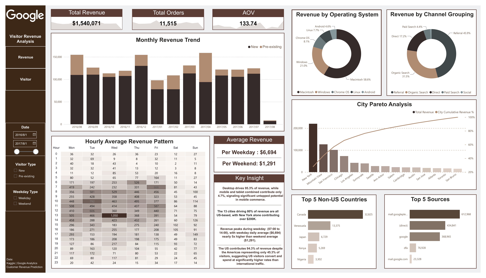
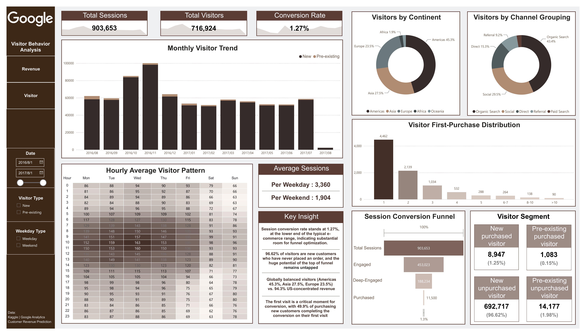
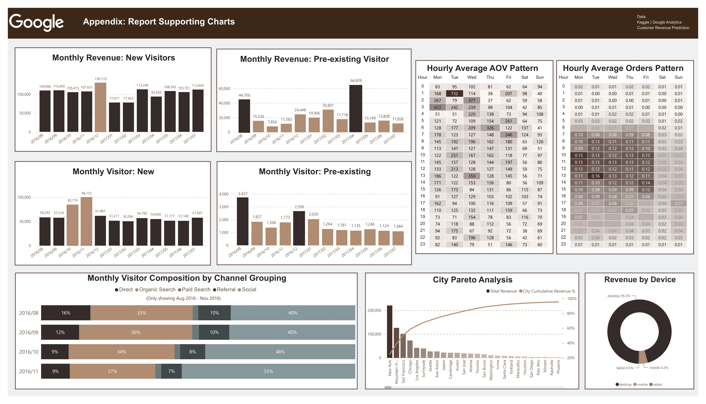

# Google Merchandise Store Visitor Analytics

### 1.项目介绍

**项目名称：谷歌商品商店访客分析**

本项目围绕Kaggle官方提供的Google Merchandise Store（简称GMS）真实数据集进行分析，得出该数据集时间段内GMS在地理、时间、客群、设备/渠道四个维度上的收入与访客行为特征，并基于这些观察分析提供一些可能的业务建议。







### 2.项目背景与目标

**背景**：Google Merchandise Store是谷歌公司运营的面向全球消费者的电子商务网站，售卖带有Google、YouTube、Android、Chrome等品牌标识的周边商品，例如服饰、配件及家具用品。在销售外，GMS常被用作Google Analytics（GA）的教学演示案例及数据分析基准，也是业内‌数据驱动运营‌的典型示范案例。GA公开的真实数据较为稀缺，同时GMS的数据作为GA官方demo账号所采用的来源，被广泛用于展示电商跟踪功能、用户行为分析及转化漏斗优化。因此，本项目希望从这份较为少见的真实数据中了解关于GMS的业务信息。

**目标**：本项目旨在通过GMS交易数据回答以下四个业务问题：
- 收入主要来自哪些地理区域、渠道、时间段？
- 访客转化路径在哪些环节流失最严重？
- 不同访客群体（新vs老、购买vs未购买）的行为特征有何差异？
- 上述行为特征背后指向哪些可优化的运营环节？

### 3.数据集说明

**数据来源**：[Kaggle - Google Analytics Customer Revenue Prediction](https://www.kaggle.com/competitions/ga-customer-revenue-prediction/overview)

**数据规模**：903,653条会话记录、716,924名独立访客、时间跨度2016-08-01至2017-08-01（美西时间）、数据粒度为会话级。

### 4.分析流程

原始数据为 GA 后台导出的会话级记录，device、geoNetwork、totals、trafficSource 四个字段以JSON嵌套形式存储，需先行扁平化，再筛除整列空值、单一值及与分析目标无关的列。

visitStartTime字段为Unix时间戳，按UTC展开后区间，根据GMS主要收入来源于美国判断数据源账户时区为America/Los_Angeles，并将时间戳完成美西时区转换，完成后时间跨度为完整一年，后续所有时间维度分析均基于美西时间。金额字段方面，GA以微单位存储货币金额，还原时保留小数精度，避免小额订单在取整后被计为零收入而丢失。

在原数据集基础上，依据fullVisitorId字段聚合构建访客维度表，创建新老访客标签、是否产生购买、首单访问序号与首单金额等字段，用于支撑访客分群与首单转化分析。转化漏斗采用逐层筛选口径，各层均为上一层的子集，以反映真实流失路径。

### 5.项目文件结构

**技术栈**
- Jupyter Notebook
- Python(pandas, numpy)
- Power BI

**文件结构**
```plaintext
Google_Merchandise_Store_Visitor_Analytics/
├── data/                               #原始数据与用于看板制作数据
│   └── README.md
├── notebooks/                           #Jupyter Notebook清洗过程
│   └── Google_Merchandise_Store_Visitor_Analytics.ipynb
├── reports/                             #分析报告
│   └── Google_Merchandise_Store_Visitor_Analytics.pdf
├── images/                              #Power BI看板静态截图
│   ├── Dashboard_1_Revenue_Analysis.jpg
│   ├── Dashboard_2_Visitor_Behavior.jpg
│   └── Dashboard_3_Appendix_For_Report.jpg
├── requirements.txt                     #项目依赖包列表
└── README.md                            #项目说明文档
```

### 6.核心发现

- GMS收入来源地理位置高度集中于美国本土。
- 访客更倾向于在工作日日间访问网站并消费，工作日日均收入约为周末五倍。
- GMS 转化漏斗流失严重（会话购买转化率仅有1.3%）。
- 桌面端（95.3%）和引荐流量（45.9%）分别是最大的设备及渠道收入来源。

### 7.业务建议

- 深耕美国本土市场，结合本地消费者需求迭代产品，挖掘未消费的新访客转化潜力。
- 重视引荐渠道、优化 SEO 投入、控制社交渠道预算，向高转化效率的渠道倾斜资源。
- 强化首单转化运营（社交媒体内嵌购买、简化结账流程），抓住发生消费的新访客里有85.3%集中在前3次访问内完成首单的关键窗口。 

### 8.项目局限性

- 本项目由于缺乏商品及活动等业务信息，只能专注于描述性分析，难以构成因果归因。例如在 2017年4-6月的时间里，新访客数量较为稳定但月收入贡献有所起伏；同时老访客数量变化较小，其贡献的收入反而在较大范围内波动。在缺乏业务数据支持的情况下，无法确定异常变化的具体原因。
-  数据集仅有一年数据，无法进行 YoY 同比分析，也无法确定上下半年是否存在不同的消费模式。同时由于数据时间较早，消费模式可能与现在有所差异。
-  本项目基于数据窗口划分“新/老访客”，不等同于真实访客生命周期分布。 

---

**完整报告链接**：完整分析请见 [Google Merchandise Store分析报告(PDF)](reports/Google_Merchandise_Store_Visitor_Analytics.pdf)

**作者信息**：全恩平，联系邮箱ellerybao@163.com
